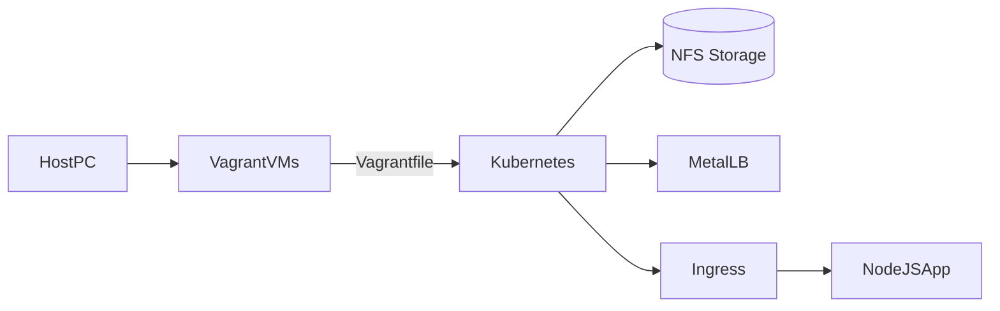

# 🧱 Architecture & Networking

## Components

!!! note
    This lab follows best practices for real-world Kubernetes networking.

- Kubernetes (Kubeadm, MetalLB, Ingress)
- Docker + Jenkins + Git + Ansible
- NFS server with RWX storage class
- Vagrant automates VM setup

## Networking Overview

## Traffic Flow

!!! tip
    Use MetalLB for allocating real IPs even in a bare-metal setup.

- MetalLB provides external IPs
- Ingress routes traffic to `/app`
- Headless service allows MySQL pod discovery
